<h1 align="center">🚀 Hello, I'm Prathamesh Dahe</h1>

  
  

<h3 align="center">Full-Stack Developer | AI/ML Engineer | Computer Engineering Student</h3>

  💡 Building <b>intelligent software systems</b> at the intersection of <b>AI, full-stack development, and embedded systems</b>.

I’m a **Computer Engineering student at Bharati Vidyapeeth College of Engineering, Pune (2023-2027)** with experience developing **AI-powered applications, computer vision systems, and scalable web platforms**.

Currently working as an **AI/ML Developer Intern** at **Expert IT Global LLC**, where I design and deploy **machine learning pipelines and real-world AI solutions**. I enjoy building products that combine **software engineering + intelligent automation + real-world data**.

---

  

---

<b>💻 Tech Stack</b>

 

### ⚡ Languages

  
  
  
  
  
  
  
  

### 🎨 Frontend

  
  
  
  
  

### ⚙️ Backend & API

  
  
  
  
  

### 🗄️ Databases & Hardware AI

  
  
  

### 🧠 AI / Machine Learning Tools

  
  
  
  

### 🛠️ Tools & Platforms

  
  
  
  
  
  

<b>🚀 Featured Projects</b>

 

| Project | Description | Stack |
|---------|-------------|-------|
| **Multilane Traffic Monitoring System** | Computer vision system for vehicle detection, lane tracking & counting. | `OpenCV`, `YOLOv12`, `Streamlit` |
| **Smart CCTV Surveillance System** | AI-powered camera system with motion detection and real-time MQTT alerts. | `Python`, `OpenCV`, `Django` |
| **AIFlix – Movie Recommendation** | Full-stack engine using LLM-assisted filtering with Google Gemini. | `React`, `Node.js`, `Gemini AI` |
| **React Admin Dashboard** | Admin dashboard with role-based access control and IoT meter tracking. | `React`, `Node.js`, `MongoDB` |
| **Disk Scheduling Visualizer** | GUI tool that visualizes OS disk scheduling algorithms (FCFS, SCAN, C-LOOK). | `Python`, `Tkinter`, `Matplotlib` |

<b>🏢 Experience & Education</b>

 

- **AI/ML Developer Intern** at *Expert IT Global LLC* 
- **Frontend Web Developer Intern** at *CyberEdus*
- **B.Tech Computer Engineering** @ *Bharati Vidyapeeth College of Engineering (2023–2027)*

<b>📊 GitHub Analytics</b>

 

  
  

  

  

 

  <b>Let's Connect!</b>   
  
  

  <i>Show some ❤️ by starring the repositories you like!</i>

